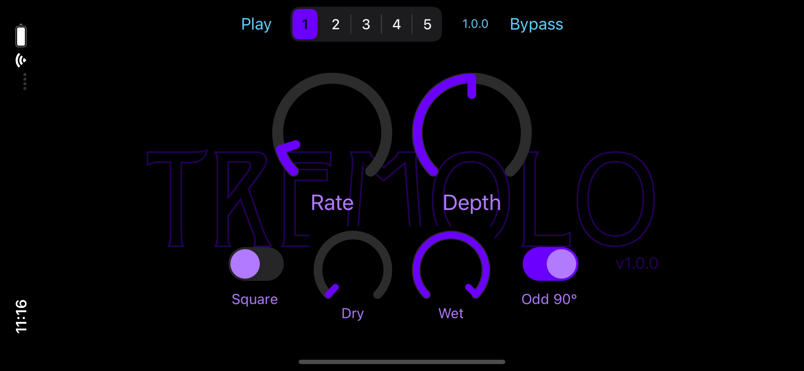

# About SimplyTremolo

This is a simple audio plugin that generates a tremolo effect on iOS and macOS platformss.

The code was developed in Xcode 12.4 on macOS 11.2.1. I have tested on both macOS and iOS devices primarily in
GarageBand, but also using test hosts on both devices as well as the excellent
[AUM](https://apps.apple.com/us/app/aum-audio-mixer/id1055636344) app on iOS.

It passes all
[auval](https://developer.apple.com/library/archive/documentation/MusicAudio/Conceptual/AudioUnitProgrammingGuide/AudioUnitDevelopmentFundamentals/AudioUnitDevelopmentFundamentals.html)
tests:

```
% auval -v aufx trlo BRay
```

Note that To successfully compile you will need to edit
[Configuration/Common.xcconfig](Configuration/Common.xcconfig) and change `DEVELOPMENT_TEAM` to hold your own
Apple developer account ID so you can sign the binaries. You should also adjust other settings as well to
properly identify you and/or your company if you desire.

> :warning: You are free to use the code according to [LICENSE.md](LICENSE.md), but you must not replicate
> someone's UI, icons, samples, or any other assets if you are going to distribute your effect on the App Store.

There are additional values in this file that you really should change, especially to remove any risk of
collision with other AUv3 effects you may have on your system.

# App Targets

The macOS and iOS apps are simple AUv3 hosts that demonstrate the functionality of the AUv3 component. In the
AUv3 world, an app serves as a delivery mechanism for an app extension like AUv3. When the app is installed, the
operating system will also install and register any app extensions found in the app.

The apps attempt to instantiate the AUv3 component and wire it up to an audio file player and the output
speaker. When it runs, you can play the sample file and manipulate the effects settings in the components UI.

# Code Layout

Each OS ([macOS](macOS) and [iOS](iOS)) have the same code layout:

* `App` -- code and configury for the application that hosts the AUv3 app extension
* `Extension` -- code and configury for the extension itself. It also contains the OS-specific UI layout
  definitions, but the controller for the UI is found in
  [Shared/User Interface/FilterViewController.swift](Shared/User%20Interface/FilterViewController.swift)
* `Framework` -- code configury for the framework that contains the shared code

The [Shared](Shared) folder holds all of the code that is used by the above products. In it you will find the
files for the audio unit ([FilterAudioUnit](Shared/FilterAudioUnit.swift)), the user changable parameters for
the audio unit ([AudioUnitParameters](Shared/AudioUnitParameters.swift)), and the audio processing "kernel"
written in C++ ([SimplyTremoloKernel](Shared/Kernel/SimplyTremoloKernel.h)).

There are adidtional details in the individual folders as well.
